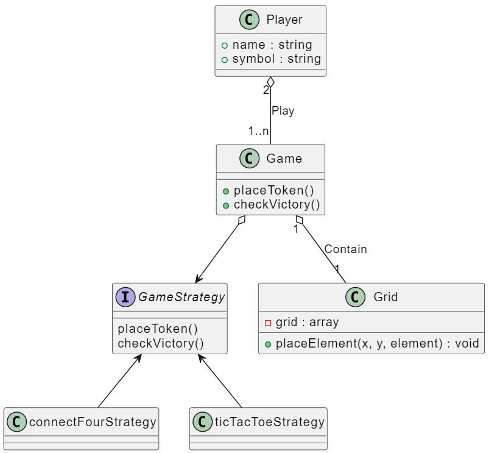

# Programmation Orientée Objet en C++, application via la modélisation d’un jeu vidéo de morpion.

## Execution du jeu
Pour lancer le programme, exécutez la commande suivante :
```bash
make run
```

## Pré-requis
- G++
- Make

## Conception
### Diagramme de classe
Ceci est une version réalisé avant l'implémentation du projet afin de mieu comprendre le sujet et de voir comment les composants pouvaient s'articuler entre eux.
Il ne correspond plus tout à fait au code final.


### Design pattern
Pour faire en sorte que ma classe game puisse gérer la partie qu'importe le type de jeu (puissance 4 ou morpion), j'ai décidé d'implémenter le [pattron de conception stratégie](https://refactoring.guru/design-patterns/strategy).