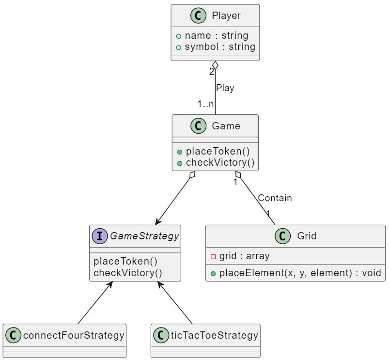

# Programmation Orientée Objet en C++, application via la modélisation d’un jeu vidéo de morpion.

Ce TP est une version amélioré du TP précédent, qui a pour but de tenter de respecter au mieux les principes SOLID.

## Execution du jeu
Pour lancer le programme, exécutez la commande suivante :
```bash
make run
```

## Pré-requis
- G++
- Make

> Sous Windows, installez ces dépendances sous WSL.

## Conception
### Diagramme de classe
Ceci est une version réalisé avant l'implémentation du projet afin de mieux comprendre le sujet et de voir comment les composants pouvaient s'articuler entre eux.
Il ne correspond plus tout à fait au code final.


### Design pattern
Pour faire en sorte que ma classe game puisse gérer la partie qu'importe le type de jeu (puissance 4 ou morpion), j'ai décidé d'implémenter le [patron de conception stratégie](https://refactoring.guru/design-patterns/strategy).

## Respect du principe SOLID

Pour refactorer le projet selon le principe SOLID, nous avons regardé le code du TP3 pour voir comment l'améliorer.

Une des premières choses que nous avons remarqué est la fonction `Game::startGame()` : elle fait beaucoup trop de choses : elle servait a demander a l'utilisateur le jeu, puis s'occupait de la boucle de gameplay. Tout ça ne correspondait pas au principe de responsabilité unique (`S`) donc nous l'avons séparé en deux fonctions `Game::selectGame()` et `Game::playGame()`.  

Nous avons ensuite modifier la signature de la fonction `Game::canPlaceToken` pour respecter la ségrégation d'interface (`I`).

En plus de cela, nous avons amélioré quelques autres éléments, comme la const correctness ou la structure du code.